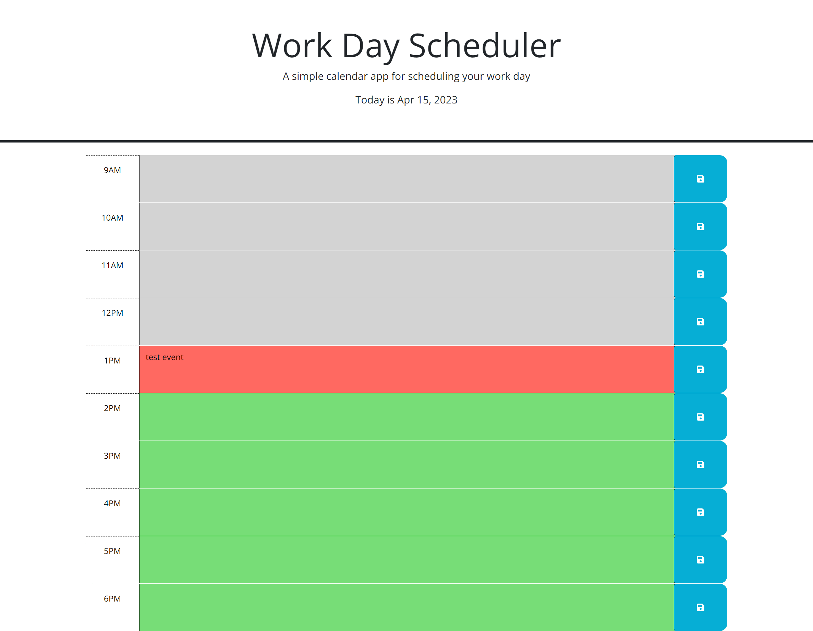

# notalisk-challenge-05

## Description

This application is a basic day planner. The goal is to help the user keep track of any tasks or scheduled events in a single day. The user can enter text into a block and click save, and the text will be saved in local storage. The date in the header updates according to the current date for the user. Each block is color coded depending on if it is in the past or future to the user's local time.

## Usage

To use, simply enter the name of the event and any relevent information in to the block corosponding to the time of the event and click the blue "save" button on the right side of that block. If you wish to update the text, simply change what you'd like and remember to hit save again. Enjoy!

## Credits

Thank you to:

Bobxcat for help on debugging JavaScript (https://github.com/Bobxcat)

## Screenshot

## Links

GitHub Repo: https://github.com/notalisk/notalisk-challenge-05

Deployed Page: https://notalisk.github.io/notalisk-challenge-05/
